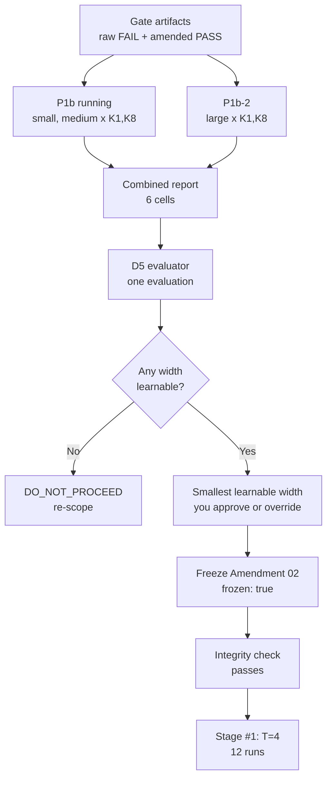

# Tesseract Phase 2 — Execution PRD

Status: **plan for review. No experiment has started, and nothing here changes
the approved protocol.** As of 2026-09-17, against commit `0d0b6f5`.

Companion documents: `PHASE2_BENCHMARK_DESIGN.md` (the approved design and
Amendment 01), `configs/phase2/amendment_02_draft.yaml` (D1–D5).

---

## 1. Purpose and scope

Phase 2 is fully implemented, verified, and completely blocked. Every component
the experiment needs exists and passes its tests; none of the 138 planned runs
can start. This document says what unblocks it, in what order, and what must be
true at each step.

This is an execution plan, not a design change. These stay exactly as they are:

- the A5 benchmark, n = 17, vocabulary 60, and F(s)[i] = s[i] · s[i+1]
- T roles: T=1 anchor, T=2 diagnostic, T=4 and T=8 primary inference
- Amendment 01, including the preserved raw G2 failure at T=2
- the Amendment 02 decision rule D1–D5 as drafted
- the D5 width and budget evaluator
- the protocol: AdamW 1e-3 / 0.01, batch 128, validation every 250 steps, no
  early stopping, best-validation checkpoint primary, final checkpoint
  sensitivity, test only after training

Two things are deliberately open because they are the researcher's to decide
after P1b: the **model width** and the **fixed step budget**. Both read
`PENDING_P1B`, and the runner refuses to train while they do.

Where something is unresolved below, it is named as a decision with its
options rather than quietly resolved.

---

## 2. Where we are today

Everything upstream of training is done and tested; the blockers are all
external to the code. 642 Python tests and 23 frontend tests pass.

| Component | State | Evidence |
|---|---|---|
| A5 benchmark, gates G1/G2 | Verified | Independent verifier passes; gates reproduce T=2 FAIL, T=4/T=8 PASS |
| Amendment 01 | Active, recorded pre-training | Amended gate run returns `PASS_WITH_AMENDMENT_01` with raw verdict FAIL preserved |
| Amendment 02 | Draft, `frozen: false` | D1–D5 recorded; decision rule reproduces all six constructed scenarios |
| D5 evaluator | Implemented, pure, 54 tests | Raises rather than deciding on absent or malformed P1b data |
| Model families | small 222,140 · medium 837,436 · large 7,230,780 | All K-invariant; one shared block measured at every K |
| 138-run matrix | Enumerated, all stages BLOCKED | Derived from config, not hardcoded |
| Status dashboard | Live | Shows pending states, fabricates nothing |

Four things block training, and the runner checks all four:

1. `model_base` is `PENDING_P1B`
2. `max_steps` is `PENDING_P1B`
3. Amendment 02 is not frozen
4. P1b has not completed

Two further gaps are not enforced by code but will stop us in practice.
**Gate artifacts do not exist in this repository** — `runs/phase2/` is absent,
so the pre-training integrity check has nothing to verify. And **P1b is running
on another device**, with `runs/` gitignored, so its results cannot arrive by
pulling.

---

## 3. The critical path

Seven steps stand between today and Stage #1, and each is gated by the one
before it. Five are mechanical; two need a decision.

Gate artifacts come **first**, not last: `run_capacity_diagnostic` calls
`require_gates_passed` before it does anything, so no diagnostic — including
P1b-2 — can run until `runs/phase2/gates_amendment01` exists with verdict
`PASS_WITH_AMENDMENT_01`. Since P1b is already running elsewhere, those
artifacts exist on that machine and should travel with the results rather than
being regenerated.

P1b and P1b-2 are **independent**: P1b-2 does not wait on P1b's outcome, and
running it cannot change the original P1b data. They meet at a single combined
report evaluated **once** by D5 — not two sequential decisions, which would let
the width be chosen after seeing partial outcomes.

Steps requiring a research decision are **E** (approve width and budget) and
**F** (freeze Amendment 02). Everything else is executable once its predecessor
is done.

The branch at **D** matters: if D5 finds no learnable width, the amendment says
do not proceed. That is a real outcome, not a failure mode to engineer around,
and it would send us back to task or capacity design rather than forward to
Stage #1.

---

## 4. Open decisions that block execution

Three decisions remain open. **D-1 is now decided.**

### D-1. Large model capacity evidence — DECIDED: Option B, P1b-2

P1b is a 2×2 diagnostic over widths {small, medium} × K {1, 8}.
`prototype_large` was added afterwards, and P1b was deliberately not modified
because it is running. The options considered were:

| Option | What it means | Verdict |
|---|---|---|
| A. Run Phase 2 on whatever D5 picks from small/medium | Large unused this phase | Rejected — no learnability evidence for the research-scale width |
| **B. Add a separately documented P1b-2 for large** | New run directory, same protocol, large × K {1,8} at T=8 | **Adopted** |
| C. Select large by fiat, outside D5 | Skip the learnability gate | Rejected — breaks the pre-registration |

**The decision rule does not change.** D5 continues to mean *select the smallest
width satisfying the pre-registered learnability criteria*. Adding large to the
candidate pool does not make large the winner; it makes large **eligible**. The
scientific principle is that we do not use 7.23M parameters because we want a 7M
model, but only if 7.23M is the smallest width that learns T=8.

Verified against the existing evaluator — no code change was needed for it to
handle three widths:

| small | medium | large | D5 selects |
|---|---|---|---|
| ✗ | ✗ | ✗ | DO_NOT_PROCEED |
| ✓ | ✗ | ✗ | small |
| ✗ | ✓ | ✗ | medium |
| ✗ | ✓ | ✓ | medium |
| ✗ | ✗ | ✓ | large |
| ✓ | ✓ | ✓ | small |

If small turns out to be sufficient, Phase 2 runs on small and the large model
becomes the flagship capability validation of §10.1 rather than this phase's
workhorse. That is a legitimate outcome, not a wasted build.

**Provenance note, to be recorded with P1b-2:**

> P1b-2 was introduced after the large model family was added to the
> implementation. It does not alter the original P1b data, protocol, or decision
> criteria. It supplies the same capacity diagnostic for the newly introduced
> research-scale width so that D5 can evaluate all candidate widths under one
> selection procedure.

Constraints carried by this decision: do not touch the running P1b; run P1b-2
independently rather than conditionally on P1b's outcome; evaluate both together
in a single D5 pass; do not pre-select large; do not freeze Amendment 02 or
start Stage #1 until the combined evaluation is approved.

### D-2. Width and budget, once D5 reports

D5 computes a recommendation; it does not decide. If the budget comes back
marked `not_converged` at 20,000 steps, that itself is a finding worth
discussing before committing 138 runs to it.

### D-3. Where the 138 runs execute

The current machine cannot do it — see §7. The matrix needs a GPU host, and
that choice affects the step budget, since budget is chosen partly on what is
affordable.

### D-4. Stage gating policy

Stage #1 is designed to stop for review. Confirm whether there should be a hard
stop after each of the seven stages, or only after #1.

---

## 5. Workstreams

### Workstream A — close P1b and fix the width

Goal: turn a finished P1b run into an approved width and budget, with the
reasoning on record. Nothing here trains anything.

- [ ] **A1. Transfer P1b artifacts.** Copy `runs/phase2/p1b_capacity_diagnostic/`
  from the other device. It is gitignored, so it will not arrive by pulling.
  Verify `run_metadata.json` records `status: completed` and note its git commit.
- [ ] **A2. Run the D5 evaluator once, on the combined report.** `evaluate_d5_file`
  over the merged six-cell report, not twice over two reports. Pure and read-only. Output: per-K learnability
  against the three criteria, a width recommendation, a budget recommendation,
  and the `k_low_at_floor` flag.
- [ ] **A3. Attach the decision to the report.** `render_d5_decision` produces a
  plain-text block for the P1b record, including the single-seed caveat.
- [x] **A4. Build P1b-2 (D-1, Option B).** Done — `configs/phase2/capacity_diagnostic_p1b2.yaml`:
  large × K {1, 8} at T=8, every other setting identical to P1b (seed 0, AdamW
  1e-3/0.01, batch 128, eval every 250, eval batch 2048, 20,000 steps,
  floor 0.02, validation only). Output directory
  `phase2/p1b2_capacity_diagnostic`. The provenance note is in the config
  header. `capacity_diagnostic_p1b.yaml` is unchanged.
- [x] **A4c. Merge step.** Done — `phase2/capacity_merge.py`: deterministic,
  read-only, preserves per-cell provenance, and refuses missing, duplicate,
  conflicting or protocol-mismatched sources rather than reconciling them. D5
  consumes the combined six-cell report with no change to its criteria.
- [ ] **A4b. Run P1b-2.** Not started. Independent of P1b; needs only the gate
  artifacts (B2/B3), not P1b's results.
- [ ] **A5. Approve width and budget.** Record the choice and any deviation from
  D5's recommendation.
- [ ] **A6. Set the config.** Replace `model_base` and `max_steps` with the
  approved values. This is the only edit that lifts two of the four blockers.
- [ ] **A7. Freeze Amendment 02.** Set `status: frozen` and `frozen: true`
  together — the loader rejects them out of step.

Exit criterion: `load_phase2_experiment().pending` returns an empty list, and
`amendment_02.frozen` is true.

### Workstream B — pre-training prerequisites

Goal: produce the gate record the integrity check demands, on a machine that can
actually run the code. Neither exists today.

- [ ] **B1. Provision a working Python.** The current machine has only 3.9.6 and
  the repo `.venv` is 3.9.6 with no torch. The research code needs ≥ 3.10.
  Without this, nothing runs locally — tests included.
- [ ] **B2. Produce the raw gate run.** `scripts/phase2_gates.py` →
  `runs/phase2/gates/`. It exits 1 because G2 fails at T=2; that is correct and
  the artifact must be kept exactly as written.
- [ ] **B3. Produce the amended gate run.** `scripts/phase2_gates_amended.py` →
  `runs/phase2/gates_amendment01/`, returning `PASS_WITH_AMENDMENT_01` and
  referencing the original report by SHA-256.
- [ ] **B4. Confirm the integrity check passes.** `check_benchmark_integrity`
  verifies the original FAIL is preserved, the G2 failures sit exactly at the
  documented diagnostic T, the benchmark matches what the gates evaluated, and
  every frozen split still matches its checksum.
- [ ] **B5. Materialise the frozen splits.** The gate run writes 96 checksummed
  val/test/length splits under `runs/phase2/splits/`. Produce once; never
  regenerate differently.

B2 and B3 must run **before** any training, because `check_preconditions` reads
their artifacts. They must run on the machine that will train, or the split
checksums have to travel with them.

Exit criterion: `check_benchmark_integrity(...)["passed"]` is true against real
artifacts.

### Workstream C — run the matrix in stages

Goal: 138 runs, in seven stages, with a hard stop after Stage #1. Each stage is
launched explicitly with `--confirm-stage`; nothing runs on a schedule.

| Stage | Family | Task | T | Depth | Runs |
|---|---|---|---|---|---|
| #1 | Tesseract | A5 main | 4 | K = 1, 2, 4, 8 | 12 |
| #2 | Tesseract | A5 main | 8 | K = 1, 2, 4, 8 | 12 |
| #2b | Tesseract | A5 main | 1, 2 | K = 1, 2, 4, 8 | 24 |
| #3 | Tesseract | C1 span control | 4, 8 | K = 1, 2, 4, 8 | 24 |
| #4 | Tesseract | C2 word control | 4, 8 | K = 1, 2, 4, 8 | 24 |
| #5 | Unrolled | A5 main | 4, 8 | L = 2, 4, 8 | 18 |
| #6 | Parameter-matched | A5 main | 4, 8 | L = 2, 4, 8 | 18 |
| #7 | Width-scaled K=1 | A5 main | 4, 8 | K = 8 | 6 |

Stage #1 has a pre-declared review with three outcomes, computed from validation
only:

- **floor** — every K below 0.02: stop and diagnose, do not continue
- **ceiling** — K=1 already at ≥ 0.9 on all seeds: no room for a K effect;
  continue only with approval
- **informative** — stop for review, then proceed

The order matters scientifically. Stages #1 and #2 are the primary depth
conditions; #3 and #4 are the controls that separate depth from span and from
composition; #5–#7 are interpretive baselines that do not enter the decision
rule. Running controls before baselines means a null result is diagnosable
earlier.

Operational guards already in place: completed cells are skipped on resume, an
incomplete cell directory is never overwritten, and a cell that diverged with a
FAIL verdict raises rather than being silently counted as done.

### Workstream D — analysis and results dashboard

Goal: turn a complete matrix into the pre-registered verdict, then make it
readable. The analysis code exists and is tested; the results view does not.

**D1. Run the pre-registered analysis.** `analyze_experiment` refuses to run
until every planned cell is complete, so this is one command, not a judgement
call. It produces per-seed Δ_s(T), DiD_s, 95 % t-intervals, K*(T), the
log₂K × log₂T interaction regression on primary T only, floor/ceiling flags,
baseline comparisons, and the D1 decision-rule outcome — computed twice, on the
best-validation checkpoint and again on the final checkpoint as sensitivity.

The rule returns one of five outcomes: supports a sequential-depth effect, span
or receptive-field explanation, composition without sequential depth,
inconclusive, or incomplete data. All five reproduce correctly on constructed
scenarios.

**D2. Build the Phase 2 results view.** The status page already carries the API
shape and the metric list; the panels are not written. Needed: T×K matrices per
task, C1/C2 controls beside the main task, the three baselines with the D3
head-dimension confound labelled, Δ_s and DiD_s with intervals, best-versus-final
comparison, per-position accuracy, and floor/ceiling state.

One design rule carries over: the view must show what the artifacts say and
nothing else. The pairing record added during the audit — `seeds_expected`,
`seeds_used`, `seeds_dropped` — should be visible, so a degraded seed set is
never invisible inside a confidence interval.

**D3. Write up.** The result is publishable whichever way the decision rule
lands, provided the pre-registration held. A null or inconclusive outcome on a
pre-registered, gated benchmark is a real finding.

---

## 6. Compute and environment

The large model makes the matrix roughly **35× more expensive** than small, and
the current laptop cannot run it. This is why D-2 and D-3 are coupled: the
budget depends on the hardware.

Summing forward FLOPs per sequence across all 138 runs, then costing a training
step at three times forward at batch 128:

| Width | Matrix forward FLOPs/seq | Per 1,000 steps | At 5,000 steps | At 10,000 steps | At 20,000 steps |
|---|---|---|---|---|---|
| small | 3.49 G | 1.34 PFLOP | 6.7 PFLOP | 13.4 PFLOP | 26.8 PFLOP |
| large | 123.20 G | 47.31 PFLOP | 236.6 PFLOP | 473.1 PFLOP | 946.2 PFLOP |

At the large width and a 20,000-step budget the matrix is roughly **0.95 EFLOP**.
Feasible on one modern GPU over days; not on CPU.

Memory is not the constraint. Measured peak RSS for the large model at batch 128,
fp32, one forward-plus-backward per K:

| K | Peak RSS | Optimizer state |
|---|---|---|
| 1 | 458 MB | 110 MB (weights + grads + 2 moments) |
| 2 | 574 MB | ″ |
| 4 | 785 MB | ″ |
| 8 | 1,207 MB | ″ |

Budget ~1.5 GB per training process at K=8, or under 1 GB in mixed precision.
Activation memory is the retained BPTT graph and scales linearly with K;
forward-only stays flat at ~380 MB.

**Environment gaps on the current machine**, both blocking:

- Python is 3.9.6; the research code needs ≥ 3.10. The repo `.venv` is 3.9.6
  with no torch, so `pytest` cannot run there.
- Node is not installed system-wide. The dashboard build and frontend tests
  currently need a supplied toolchain.

Before committing to a budget, measure one real step on the target GPU. The
runner already records `seconds_per_train_step` per cell and fits step time
against block executions, so a single calibration run turns these FLOP figures
into a wall-clock estimate.

---

## 7. Risks

Each of these has either already happened in this project or is a named failure
mode in the design.

| Risk | Why it is live | Mitigation |
|---|---|---|
| P1b artifacts lost in transfer | `runs/` is gitignored; results cannot arrive by pulling | Copy by hand, verify the run's git commit and the report SHA-256 before trusting it |
| Width chosen without evidence | D5 cannot select large; pressure to pick it anyway | Resolve D-1 explicitly; never let a config default decide |
| Gate artifacts regenerated differently | Splits are checksummed; a mismatch invalidates the frozen data | Produce gates once on the training machine; integrity check verifies all 96 split checksums |
| A diverged cell silently shrinks n | Found and fixed in audit: a FAIL cell was counted as complete | Fixed — FAIL raises on resume, is excluded from analysis, and pairing coverage is reported |
| T=2 shortcut misread as a result | 26.7 % agreement with the span control is an algebraic property | Amendment 01 keeps T=2 diagnostic and out of primary inference; the dashboard shows raw FAIL |
| Floor at T=8 | Phase 1 hit exactly this; the whole point of P1b | Stage #1 review stops on floor before 126 further runs are spent |
| Head-dimension confound widens at scale | Parameter-matched at L=8 drops head_dim to 11 at large, versus 12 at small | Accepted under D3, recorded per run, asserted by test — but report it more prominently at large scale |
| Budget too small, results under-trained | D5's budget rule can return `not_converged` | Treat `not_converged` as a discussion trigger, not a rubber stamp |
| Cross-device drift | Two machines, gitignored artifacts | Every run records its git commit; check it matches the frozen code before analysis |

The risk to watch hardest is the second. Everything else has a mechanical guard;
that one depends on a judgement being made deliberately.

---

## 8. Definition of done

Phase 2 is complete when all of the following hold. None of them is "the
hypothesis was confirmed" — a pre-registered null is a finished result.

1. P1b closed, D5 applied, width and budget approved and recorded with their
   reasoning.
2. Amendment 02 frozen before the first training run, with the freeze commit
   predating every run's git commit.
3. Gate artifacts present, integrity check passing, all 96 split checksums
   verified.
4. All 138 cells complete, each with a persisted best and final checkpoint and a
   recorded SHA-256.
5. `analyze_experiment` run once on the complete matrix, producing
   `analysis.json` and a decision-rule outcome on both checkpoints.
6. Every comparison fully paired, or the dropped seeds explicitly reported.
7. Results dashboard reading real artifacts, fabricating nothing.
8. Write-up stating the outcome, the T=2 diagnostic caveat, the head-dimension
   confound, the shared learning rate, the single-seed basis of the width
   choice, and that the benchmark is synthetic by construction — so the claim
   is scoped to tasks with provably known sequential depth (§10).

What would make the result *strong*, beyond merely done: main Δ(8) positive with
an interval excluding zero, main DiD positive with an interval excluding zero,
main DiD exceeding C2's, and both C1 deltas including zero. That is the D1 rule's
"supports a sequential-depth effect" branch, and the only branch that licenses
the depth claim.

---

## 9. Immediate next actions

In order. The first two need nothing from P1b and can start now.

| # | Action | Owner | Blocked by |
|---|---|---|---|
| 1 | Provision Python ≥ 3.10 with torch, on whichever machine will train | Researcher | Nothing |
| 2 | ~~Build the P1b-2 config and its merge step~~ — done, not run | Implementation | — |
| 3 | Copy gate artifacts across from the P1b machine, or produce them | Researcher / Implementation | 1 |
| 4 | Run P1b-2 — large × K {1,8}, independent of P1b | Implementation, on confirmation | 2, 3 |
| 5 | Copy P1b artifacts across when that run finishes | Researcher | P1b |
| 6 | Merge into one six-cell report, run D5 once, attach the decision | Implementation | 4, 5 |
| 7 | Approve width and budget | Researcher | 6 |
| 8 | Set config, freeze Amendment 02 | Implementation, on approval | 7 |
| 9 | Confirm integrity check, launch Stage #1, stop for review | Implementation, on confirmation | 3, 8 |

Steps 1 and 2 are the real unblockers and need nothing from P1b. Step 4 is the
first thing in this plan that trains anything, and it is a diagnostic, not a
Phase 2 run — the Amendment 02 freeze requirement applies to the matrix via
`check_preconditions`, not to capacity diagnostics.

Everything from step 5 on is sequenced by P1b, which is not ours to hurry.

---

## 10. Out of scope for Phase 2

Phase 2 answers exactly one question: **does increasing K cause an improvement
on a task whose required sequential depth T is known and controlled?** It does
not answer how capable Tesseract is, and it does not show that the effect
transfers. Those are separate questions needing opposite methods, and conflating
them would cost the causal claim.

The protocol is restrictive on purpose. Phase 1's cellular-automaton grid
stopped on train loss, so its sixteen cells trained for 787 to 2,000 steps — a
2.5× spread. A difference between cells could have come from recursion or from
training length, and there was no way to tell. The fixed budget, shared learning
rate and fixed batch exist to remove that class of confound, not to limit the
architecture. K itself is swept 1→8, BPTT is full and untruncated, and the width
is chosen by P1b to be sufficient rather than convenient.

Three things are therefore deliberately excluded, each with where it belongs.

### 10.1 Unconstrained capability run — Phase 3

Same architecture, best width, a tuned learning rate and schedule, a long budget,
trained to convergence rather than to a fixed step count. Reported as a
capability number with **no causal claim attached**.

This cannot share a phase with the controlled grid: once each configuration is
tuned separately, every tuning choice becomes an alternative explanation for any
difference between them. Run the controlled experiment first, then the
unconstrained one, and report them as the two different things they are.

### 10.2 Generalisation beyond the synthetic benchmark — Phase 3

The A5 automaton is synthetic by construction, and that is what makes it usable:
no natural dataset lets you dial required computational depth from 1 to 8 while
holding sequence length, vocabulary, input distribution and output space fixed.
The cost is that a positive result is an existence proof on a task with provably
known depth — not evidence about language, reasoning benchmarks, or anything
deployed.

Extending the claim one step means a second benchmark family under the same
K-scaling protocol. `PHASE2_BENCHMARK_DESIGN.md` §2 already assesses two
candidates: the S₅ word problem (established literature, Barrington's theorem,
but input length grows with T) and pointer chasing (attention-native, but depth
scales as log T). Either would need its own gates.

### 10.3 Per-family learning-rate tuning

Dropped by Amendment 02 D2 and disclosed: baseline comparisons are conditional
on a shared 1e-3. Removing this confound means re-running every baseline under a
per-family sweep, which is a Phase 3 cost, not a Phase 2 fix.

### What this means for the write-up

State the scope in the claim itself, not in a footnote. The defensible sentence
is of the form *"on a benchmark where required sequential depth is known and
shallow shortcuts are ruled out by construction, increasing recursive depth K
improves accuracy, and the improvement grows with T"* — with the C1/C2 controls
and the three baselines as the evidence that it is depth rather than span,
composition, or parameters.

A null or inconclusive result under this protocol is equally publishable, and
for the same reason: the pre-registration and the gates are what make either
outcome informative.
